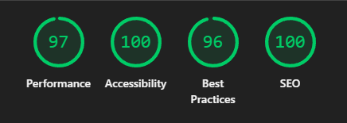

# Portfolio Website

A modern, mobile-friendly portfolio website built to showcase my UI/UX design work, projects, and background.  
The site is designed with a strong focus on **usability, SEO best practices, and performance optimization**.

## ✨ Key Highlights

- 📱 **Mobile-first & responsive design**
- 🔍 **SEO-friendly structure** (semantic HTML, metadata, optimized headings)
- ⚡ **Performance-tuned** for fast load times
- 🎨 Clean, user-centered UI/UX design
- ♻️ Reusable and scalable components

## 📊 Lighthouse Performance Results

The portfolio has been tested using **Google Lighthouse** for both **Desktop** and **Mobile** to ensure strong performance, accessibility, and SEO.

### 🌐 Desktop (Web)



### 📱 Mobile


These results reflect a strong focus on:

- Performance optimization
- SEO best practices
- Accessibility
- Mobile-first design

## 🛠 Tech Stack

- **Framework:** Next.js
- **Styling:** Tailwind CSS
- **Design:** Figma
- **Icons:** Lucide Icons
- **Image Optimization:** Next.js Image
- **Deployment:** Vercel

## 📁 Featured Projects

- **Sokoban Project** – Puzzle game UI and interaction design
- **Hospital Billing System** – User-centered interface for healthcare billing workflows
- **Web & UI Design Works** – Selected academic and professional projects

## 🎯 Focus Areas

- Mobile usability and accessibility
- Search engine visibility and clean metadata
- Optimized assets and efficient rendering
- Clear information hierarchy and navigation

## 🚀 Getting Started

```bash
npm install
npm run dev
```

Open http://localhost:3000 to view the project locally.

## 📄 License

This project is for personal portfolio use only.
All content and designs are not intended for redistribution without permission.
